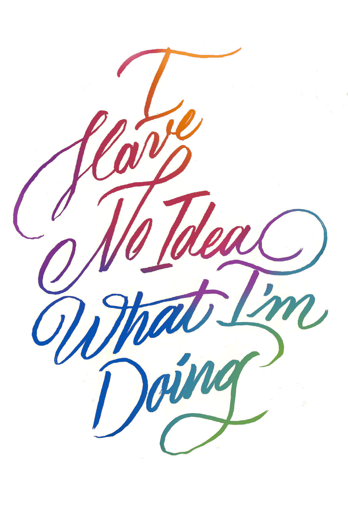
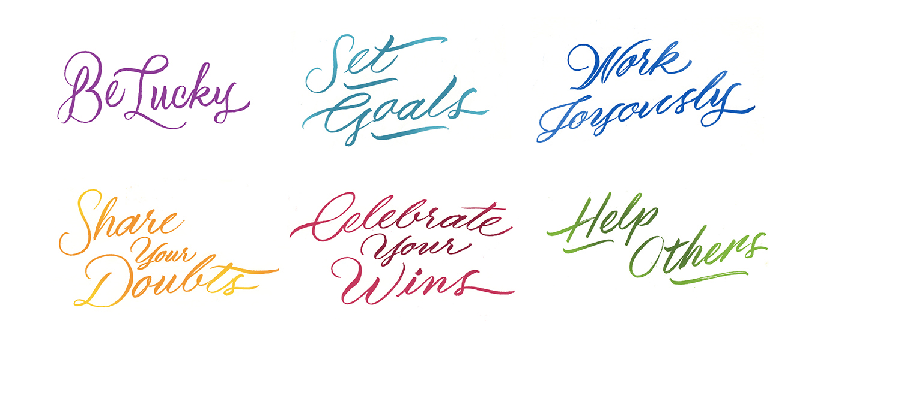

Exploring impostor syndrome, the fine line between deceit and 'fake it til you make it,' and discovering ways we can be intentful about how we learn, challenge ourselves, and share our knowledge.

## Conferences

* Front End Design Conf · St. Petersburg, FL · July 11, 2014
* CSSConf Oakland · Oakland, CA · December 9, 2014
* Converge SE · Columbia, SC · April 16, 2015

## Overview

We've all felt compelled to say, "oh but I'm so bad at this," lest someone think we might have something valuable to say. We've all felt that surge of inspiration, followed by frustration, sometimes to the point of being unwilling to try again.

Why say you am not good at something? Doesn't being challenged matter? Is being good at something the only measure of its worth?

In this talk I explore how we learn, the fine line between deceit and "fake it til you make it," and discover some ways we can be intentful about how we learn, challenge ourselves, and share our knowledge.

* Be lucky
* Set Goals
* Work joyously
* Share your doubts
* Celebrate your wins
* Help others

## Notes

* <a href="http://ja.mesbrown.com/2014/07/front-end-design-conference-elyse-holladay-i-have-no-idea-what-im-doing/">James Brown notes from FrontEndConf 2014</a>
* <a href="http://nathanieldeal.tumblr.com/post/91454181246/2014-front-end-design-conference">Nathaniel Deal's notes from FrontEndConf</a>
* <a href="http://helenvholmes.com/notes/i-have-no-idea-what-i-am-doing/">Helen Holmes notes from CSSConfOakland</a>
* <a href="https://medium.com/salesforce-ux/cssconf-oakland-b24c8b12da25">Jina Bolton's notes from CSSConfOakland</a>
* <a href="https://www.flickr.com/photos/matthewbergman/15370053253/in/photostream/">audience participation photo from CSSConfOakland</a>

## Resources

* <a href="http://jangosteve.com/post/380926251/no-one-knows-what-theyre-doing">No One Knows What the F*** They’re Doing (or “The 3 Types of Knowledge”)</a>
* <a href="http://buff.ly/1lFlaNA">How Developers Stop Learning: Rise of the Expert Beginner</a>
* <a href="http://en.wikipedia.org/wiki/Dreyfus_model_of_skill_acquisition">Dreyfus Model of Skill Acquisition</a>
* <a href="https://blog.srnd.org/we-are-all-bad-programmers-a85b27db8546">We are All Bad Programmers, Tyler Menezes</a>
* <a href="http://www.listsofnote.com/2012/01/henry-millers-11-commandments.html">Henry Miller's Commandments of Work</a>
* <a href="http://www.kitchensoap.com/2012/10/25/on-being-a-senior-engineer/">On Being a Senior Engineer, John Allspaw</a>
* <a href="http://katemats.com/finding-your-flow-and-motivation-leveling-up/">Kate Mats, Finding your Flow</a>
* <a href="http://katemats.com/overcoming-self-doubt/">Kate Mats, Overcoming Self Doubt</a>
* <a href="http://katemats.com/how-to-make-your-own-luck/">Kate Mats, Make your own Luck</a>
* <a href="https://speakerdeck.com/pycon2014/its-dangerous-to-go-alone-battling-the-invisible-monsters-in-tech-by-julie-pagano">It's Dangerous to Go Alone — Julie Pagano</a>
* <a href="http://www.gradhacker.org/2011/09/02/banishing-impostor-syndrome/">Banishing Impostor Syndrome</a>
* <a href="http://alistapart.com/article/people-skills-for-web-workers">ALA People Skills for Web Workers</a>
* <a href="http://devblog.avdi.org/2014/02/10/the-passion-gospel/">The Passion Gospel, Avdi</a>
* <a href="https://twitter.com/oscargodson/status/451230412233142273">Programmer Levels, @oscargodson</a>
* <a href="https://twitter.com/bantik/status/443971420218228736">Impostor Syndrome Tip, @bantik</a>
* <a href="https://twitter.com/jessisheron/status/441080023554854912">@jessiheron "I drew the inside of my brain at all times"</a>

### Credits
Custom typography beautifully done for me by <a href="http://jillianadel.com/">Jillian Adel</a>.
