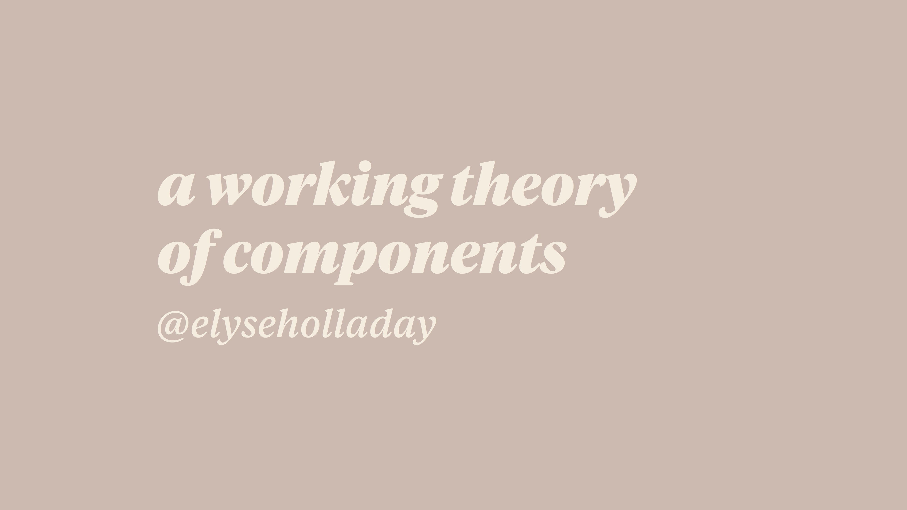
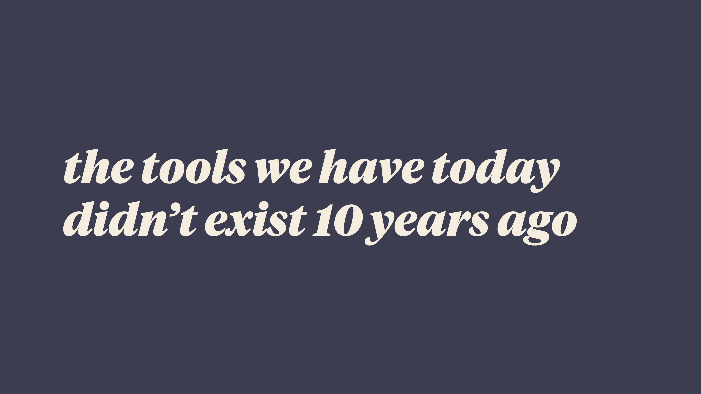
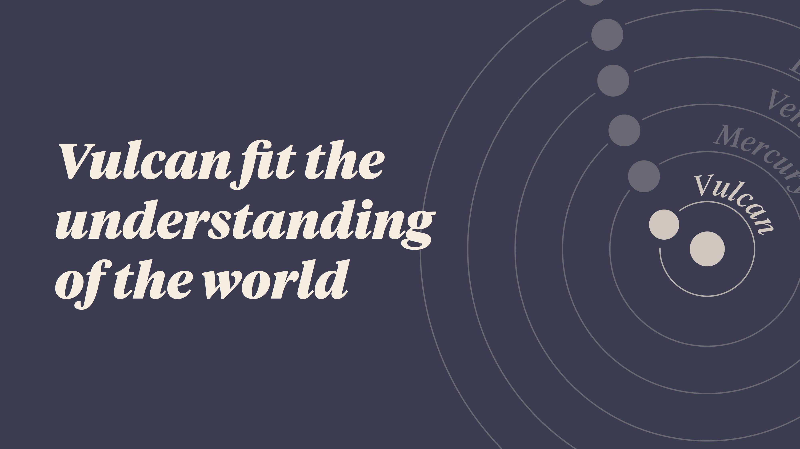
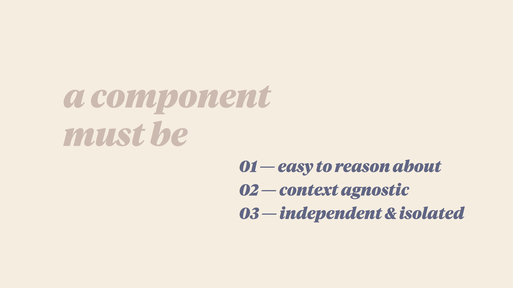
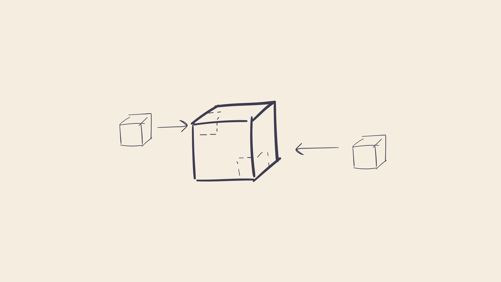
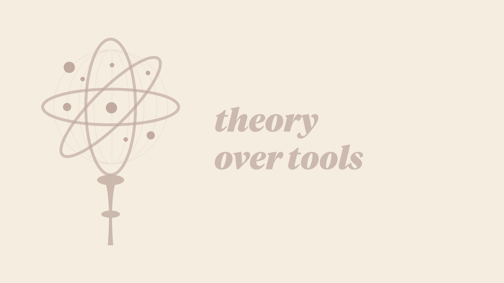
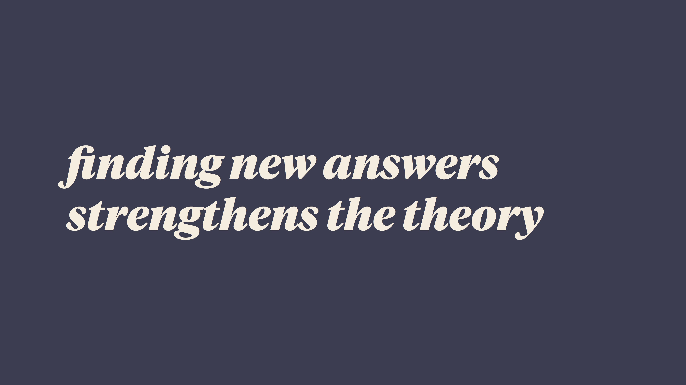

Design Systems are our current model of making sense of the intersection of front-end code and design. With the tools we have today, what is our working model of a component? How do we define them, create them, and ensure they work at scale? In this talk we’ll discuss how our tools affect our understanding, create a checklist of factors that make a component a component, and how to implement the theory of components with the tools you have at hand.

    
    
    
    
    
    
    
    

## Overview

Over the past 15 years, our understanding of the world of front end development has changed. We have been iterating constantly on our working theory of how to design and code for the web.

We’ve used the tools we have not just to create solutions to the problems we face, but also to create new tools. These tools aren’t just helping us do our job; they are _changing_ the way we can even _conceptualize_ our work. We’re building on what we learned previously, filling in the gaps and unknowns. We are coming to a new understanding, with these new tools, of how to create the front end at scale: Design Systems.

We want isolated components that we can reuse, styles that don’t conflict, and an easy authoring experience.

At a high level, we know that a component needs to be three things:

1. — easy to reason about
2. — context agnostic
3. — independent and isolated

Our theory of components should be mostly applicable regardless of our tools. What works for one project may not work for another. But when you find things that don’t work, gaps in our knowledge, that doesn’t mean the whole theory is broken.

We are experimenting with this theory of design systems every day as we work. What we learn will add to the theory, help us move forward, and create even better tools to improve our work. Searching for new solutions might even propel us forward so far we have as many new questions as answers. As we work together today and tomorrow and in the months and years to come, keep thinking beyond today’s understanding of the world, and on to tomorrow’s.

## Notes 

_Did you take notes during this talk? Share them with me and I'll share them here!_

## Resources

### Books
These books inspired the science story in my talk. _Black Holes Blues_ especially is the best book I have read in a long time. I highly recommend it!

* <a href="https://www.amazon.com/American-Eclipse-Nations-Catch-Shadow/dp/1631490168">David Baron, American Eclipse</a>
* <a href="https://www.amazon.com/Black-Blues-Other-Songs-Outer/dp/030794848X">Janna Levin, Black Hole Blues</a>
* <a href="https://www.amazon.com/Hunt-Vulcan-Discovered-Relativity-Deciphered/dp/0812998987">Thomas Levenson, The Hunt for Vulcan</a>

### Science Links

* <a href="http://www.sciencemag.org/news/2016/12/ripples-spacetime-sciences-2016-breakthrough-year">Ripples in spacetime: Science's 2016 Breakthrough of the Year, sciencemag.org</a>
* <a href="https://phys.org/news/2017-09-ligo-virgo-observatories-black-hole.html">LIGO and Virgo observatories detect gravitational wave signals from black hole collision, phys.org</a>
* <a href="https://www.economist.com/news/science-and-technology/21679172-century-ago-albert-einstein-changed-way-humans-saw-universe-his-work">The most beautiful theory, economist.com</a>
* <a href="http://www.mathouriste.eu/Obs_Paris/Le_Verrier/Le%20Verrier.html">Happy Bicentennial, Mr. Le Verrier, mathouriste.eu</a>
* <a href="https://www.oddsalon.com/jan-2-1860-the-discovery-of-planet-vulcan/">Jan 2, 1860, the Discovery of Planet Vulcan, oddsalon.com</a>
* <a href="https://www.brainpickings.org/2016/11/29/janna-levin-black-hole-blues-science/">Janna Levin on Black Hole Blues, brainpickings.org</a>

### Tech Links

* <a href="https://github.com/suitcss/suit/blob/master/doc/components.md#styling-dependencies">SUIT CSS Styling dependencies</a>
* <a href="http://www.didoo.net/to-bem-or-not-to-bem/10__interview-with--mark__dalgleish.html">Interview with Mark Dalgleish, didoo.net</a>
* <a href="https://markdalgleish.github.io/presentation-first-class-styles/">Mark Dalgleish, First Class Styles presentation</a>
* <a href="https://medium.com/@didoo/let-there-be-peace-on-css-8b26829f1be0">Let There Be Peace on CSS, didoo.net</a>
